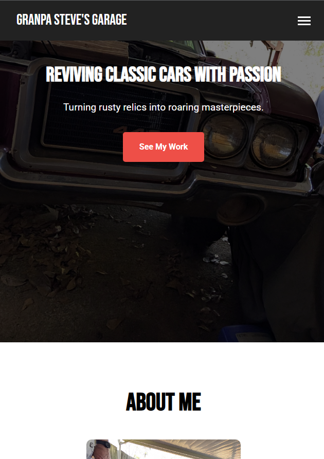
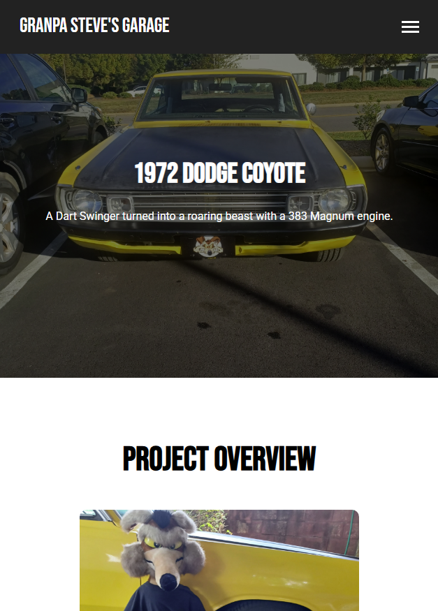

# Granpa Steve's Garage 🏎️

Welcome to **Granpa Steve's Garage**, a website showcasing my father in law's passion for classic car restorations! This project features detailed pages for his restoration projects with a responsive design, a lightbox gallery, and smooth animations.


## 🚗 About the Project

Granpa Steve's Garage is a personal website where I share his journey of reviving classic cars from the 70s, specializing in Oldsmobile and Mopar projects. The site includes:

- A homepage with a hero section, about me, and a project gallery.
- Dedicated project pages for the 1972 Dodge Coyote, featuring a detailed description, images, and a lightbox gallery.
- Responsive design for mobile and desktop users.
- Smooth animations and interactive elements like a hamburger menu and lightbox.

## 🛠️ Technologies Used

- **HTML**: Structure of the website.
- **CSS**: Styling with custom animations and responsive design.
- **JavaScript**: Interactivity, including the hamburger menu, form submission, and lightbox gallery.
- **Fonts**: Google Fonts (Roboto and Bebas Neue) for typography.
- **Hosting**: Deployed on AWS S3 with Cloudflare for security and performance.

## 📸 Screenshots

### Homepage


### Dodge Coyote Project Page


## 🚀 Getting Started

To run this project locally:

1. **Clone the Repository**:
   ```bash
   git clone https://github.com/your-username/grandpastevesgarage.git